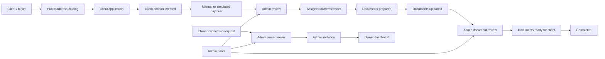
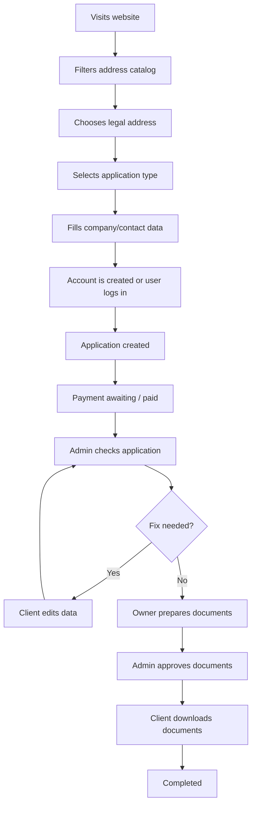
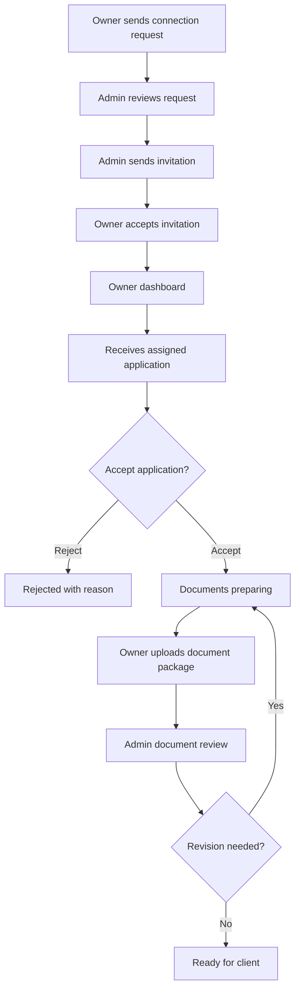
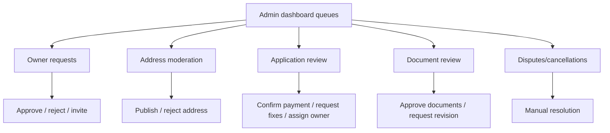
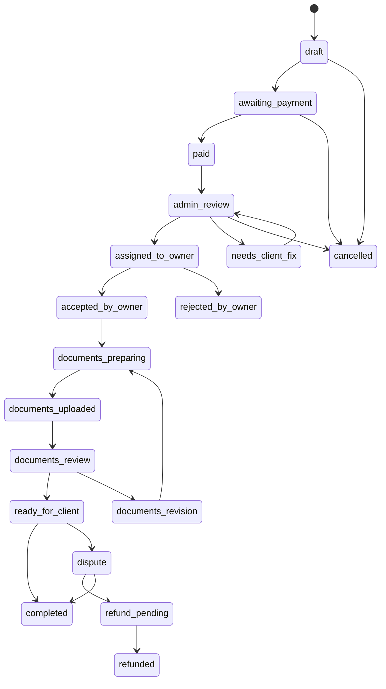
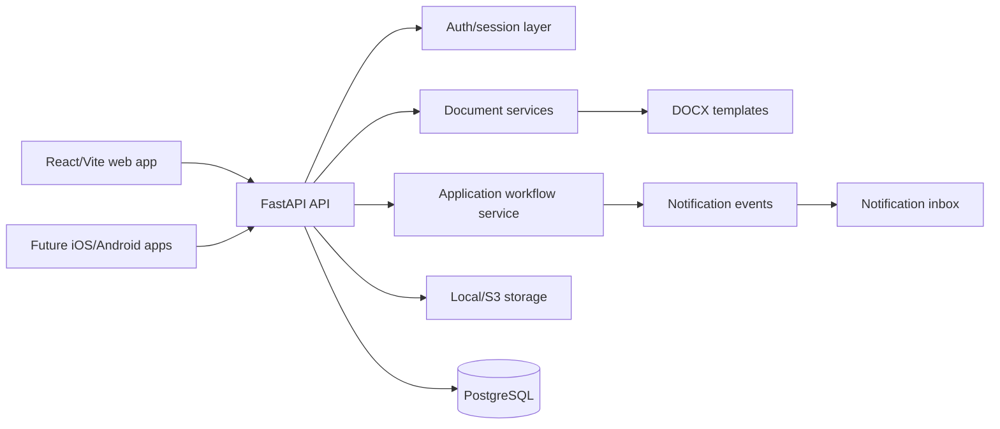

# Handoff: Legal Address Marketplace

Date: 2026-05-10

This document exports the current project context for continuation in Claude Code or another coding agent.

## 1. Product Scheme

The project is a marketplace of legal addresses. Property owners publish premises. Clients choose an address, create an application, and receive documents. The platform admin manually checks critical transitions.



## 2. Roles

### Client

The service user: founder, director, accountant, lawyer, or registration agent. The client can:

- browse the public catalog;
- submit an application;
- receive an account during application submission;
- track application status;
- respond to correction requests;
- download approved documents;
- confirm completion or open a dispute later.

### Owner / Provider

The executor and property owner or authorized representative. The owner can:

- submit a public connection request;
- join after admin invitation;
- manage provider profile and addresses;
- receive assigned applications;
- accept or reject applications;
- prepare and upload documents;
- fix documents after admin revision request.

### Admin

The marketplace operator. The admin can:

- review owner connection requests;
- invite owners;
- moderate owner profiles and addresses;
- review client applications;
- manually confirm payment;
- assign applications to owners;
- review uploaded documents;
- send applications back to client or owner for fixes;
- cancel applications, resolve disputes, and complete applications.

## 3. Client Path



## 4. Owner Path



## 5. Admin Path



## 6. Application Status Model

### Main Chain



### Statuses

| Status | Meaning |
|---|---|
| `draft` | Application created or not fully completed. |
| `awaiting_payment` | Waiting for payment or manual invoice confirmation. |
| `paid` | Payment is confirmed. |
| `admin_review` | Admin checks the application. |
| `needs_client_fix` | Client must fix data or provide more information. |
| `assigned_to_owner` | Application is assigned to owner/provider. |
| `accepted_by_owner` | Owner accepted the application. |
| `rejected_by_owner` | Owner rejected the application with reason. |
| `documents_preparing` | Owner is preparing documents. |
| `documents_uploaded` | Owner uploaded the document package. |
| `documents_review` | Admin checks uploaded documents. |
| `documents_revision` | Documents returned to owner for revision. |
| `ready_for_client` | Documents are approved and available to client. |
| `completed` | Application is completed. |
| `cancelled` | Application is cancelled. |
| `dispute` | Manual dispute state. |
| `refund_pending` | Refund is required. |
| `refunded` | Refund is completed. |

Legacy statuses still exist and should not be removed without a migration plan: `guarantee_issued`, `awaiting_contract`, `contract_signed`, `active`, `expired`, `terminated`.

## 7. Documents

Client-side document types:

- `client_requisites`: client requisites;
- `company_details`: company card/details;
- additional supporting files can be added later.

Owner-side document types:

- `ownership_proof`: ownership confirmation;
- `guarantee_letter`: guarantee letter;
- `contract`: contract;
- `act`: act;
- `owner_consent`: owner consent;
- `postal_service`: postal service agreement/confirmation.

Admin-side document type:

- `admin_review_file`: checked or service file related to moderation.

Existing generation pipeline also supports generated contract, guarantee letter, and package ZIP.

## 8. Manual Verification Points

Manual checks required in MVP:

- owner connection request review;
- owner invitation decision;
- provider profile review;
- address publication moderation;
- client application review;
- payment confirmation;
- owner assignment;
- uploaded document moderation;
- client correction request;
- owner document revision request;
- cancellations, disputes, and refunds.

## 9. Implemented Modules

| Module | Git commit | Status |
|---|---:|---|
| Public address catalog | `dc9c482` | Done |
| Client application form | `c1efd35` | Done |
| Client dashboard | `c222f20` | Done |
| Mobile API auth readiness | `a664ffe` | Done |
| Owner dashboard | `2706fc2` | Done |
| Application status workflow | `10abf38` | Done |
| Owner document upload | `2a4168f` | Done |
| Admin document moderation | `227cdcf` | Done |
| Demo seed data | `979686f` | Done |
| Notification inbox | `b2d47d4` | Done |
| Admin workflow actions | `6b93375` | Done |

## 10. MVP Scope

Included in MVP:

- real roles and login;
- public address catalog;
- owner connection request;
- admin owner invitation;
- client application with account creation;
- client dashboard;
- owner dashboard;
- admin panel with manual moderation;
- marketplace application statuses;
- upload/download documents;
- internal notifications;
- demo seed data;
- tests for key API and workflow transitions.

Postponed:

- real payment acquiring;
- escrow and split payments;
- email/Telegram/SMS delivery;
- push notifications for native apps;
- OCR/document recognition;
- electronic signatures;
- automatic legal document approval;
- owner self-service publishing without moderation;
- production-grade analytics and billing.

## 11. Mobile Context

The service must later support iOS and Android apps. Existing backend changes already account for this:

- web uses HttpOnly cookie sessions;
- native apps use bearer sessions through `POST /mobile/auth/login`;
- same session table supports cookie and bearer access;
- protected endpoints accept `Authorization: Bearer <access_token>`;
- enum values must remain stable;
- uploads should remain multipart;
- push notification device registration should be a future separate module.

See `docs/mobile-api.md`.

## 12. Technical Structure



Important backend areas:

- `app/main.py`: app entrypoint, CORS, routers, auth middleware;
- `app/enums.py`: stable enum source;
- `app/models`: SQLAlchemy models;
- `app/schemas`: Pydantic contracts;
- `app/routers`: FastAPI endpoints;
- `app/services`: domain logic;
- `alembic/versions`: migrations;
- `tests`: backend regression tests.

Important frontend areas:

- `frontend/src/App.tsx`: authenticated app shell and dashboards;
- `frontend/src/publicCatalog.tsx`: public catalog/application flow;
- `frontend/src/api.ts`: API client;
- `frontend/src/types.ts`: frontend contracts;
- `frontend/src/styles.css`: UI styling.

## 13. Runbook

Backend:

```bash
source .venv/bin/activate
alembic upgrade head
uvicorn app.main:app --host 127.0.0.1 --port 8000 --reload
```

Frontend:

```bash
cd frontend
npm install
npm run dev -- --port 5173
```

Tests:

```bash
source .venv/bin/activate
pytest
cd frontend && npm run build
```

Demo seed:

```bash
source .venv/bin/activate
python -m scripts.seed_marketplace_demo --password demo12345
```

## 14. Next Recommended Work

Recommended next stage: provider onboarding and invitation completion.

Scope:

1. Admin queue for public owner connection requests.
2. Admin action to mark request as reviewing/rejected/invited.
3. Admin action to create owner invitation from an approved request.
4. Owner invitation acceptance validation and owner-provider binding.
5. UI for owner request statuses.
6. API tests for request review, invitation creation, and role access.

Following stages:

- address publication moderation;
- client correction workflow;
- manual payment confirmation;
- more complete admin queues;
- mobile API coverage beyond auth;
- email/Telegram/SMS notification adapters;
- production deployment packaging.

## 15. Git History Snapshot

Recent commits:

```text
6b93375 feat: add admin workflow actions
b2d47d4 feat: add notification inbox
979686f feat: add demo marketplace seed data
227cdcf feat: add admin document moderation
2a4168f feat: add owner document upload
10abf38 feat: add application status workflow
2706fc2 feat: add owner dashboard
a664ffe feat: prepare mobile api auth
c222f20 feat: add client dashboard
c1efd35 feat: add public client application form
dc9c482 feat: add public address catalog
76ff110 docs: plan public address catalog
```

Development convention: save every meaningful stage as a git commit.
